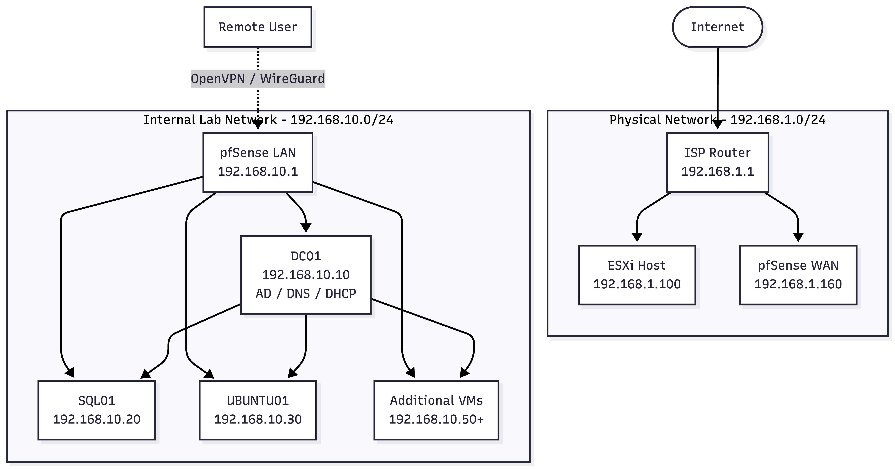

# Homelab - Proxmox UTM Virtualization & Network Infraestructure

## Overview
This project is a complete virtualized IT infraestructure built from scratch to simulate an enterprise environment. Designed to demonstrate hands-on skills in virtualization, Windows Server administration, networking, security, and database management. 

   
   

## Architecture
 

## Components
| Component | Details |
|-----------|---------|
| **Hypervisor** | UTM (QEMU) on Apple Silicon (M4)|
| **Firewall / VPN** | pfSense CE with NAT, Port Forwarding, OpenVPN/WireGuard |
| **Domain Controller** | Windows Server 2022 with Active Directory, DNS, DHCP |
| **Database Server** | Microsoft SQL Server 2022 Express |
| **Linux Server** | Ubuntu 22.04 LTS |
| **Documentation** | Private Wiki (BookStack) |

## Key Features
- Virtualized environment with 6+ VMs
- Active Directory domain ('homelab.local')
- DNS forwarders and DHCP scope
- pfSense firewall rules with port forwarding
- OpenVPN for secure remote access
- SQL Server with backup routines
- Full network documentation (diagrams, IP plan, troubleshooting guides)

## Guides
- [Lab Inventory](docs/lab-inventory.md)
- [Service Matrix](docs/service-matrix.md)
- [Backup and Restore](docs/backup-restore.md)
- [Validation Report](docs/validation-report.md)

## Validation Checklist
Use this checklist after making changes to the lab or rebuilding any component.

### Completed / Verified
- pfSense WAN connectivity is up and the internal interface is reachable.
- pfSense WebGUI access works from the management network.
- Firewall rules allow the intended traffic and keep default-deny behavior intact.
- DNS resolves internal hostnames and forwards external queries correctly.
- DHCP leases are being issued in the expected scope and subnet.
- The domain controller can support Active Directory, DNS, and DHCP functions.
- WireGuard remote access has been configured and verified from a client device.

### In Progress / Planned
- Proxmox host health and VM uptime checks.
- Full OpenVPN deployment.
- Dedicated internal subnet migration to `10.0.2.0/24`.
- Port forwarding for additional internal services.
- Syslog logging and automatic configuration backups.
- Full off-network VPN test from an external connection.
- SQL Server backup routines and verification on the server.
- Linux server service checks.
- Documentation, IP plan, and troubleshooting notes staying in sync with the current lab state.

## Scripts
- Here I will place all the scripts.

## Screenshots
- Here I will place all the screenshots: [screenshots/](screenshots/)

## Skills Demonstrated
- UTM (QEMU) on Apple Silicon (M4)
- Windows Server Administration (AD, DNS, DHCP)
- Networking (TCP/IP, Routing, Firewall, VPN)
- Security (NAT, firewall rules, VPN encryption)
- Database Administration (MS SQL Server)
- Automation (PowerShell, Bash)
- Documentation (Technical writing, diagrams)

## Date
July 2026

---

Built by [Joaquin Baltasar Villegas](https://github.com/jbvillegas) 
